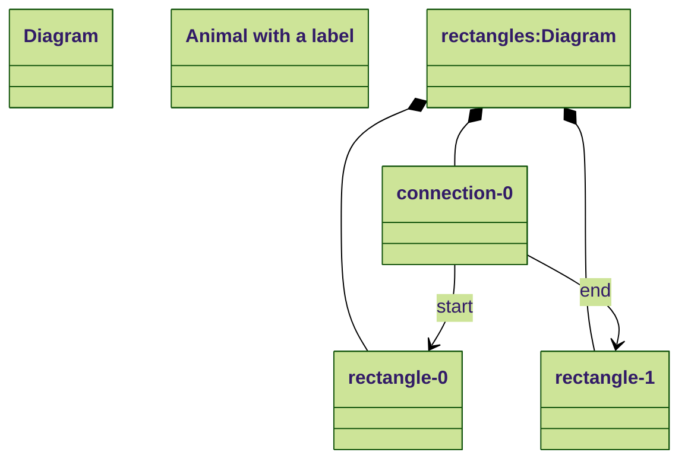
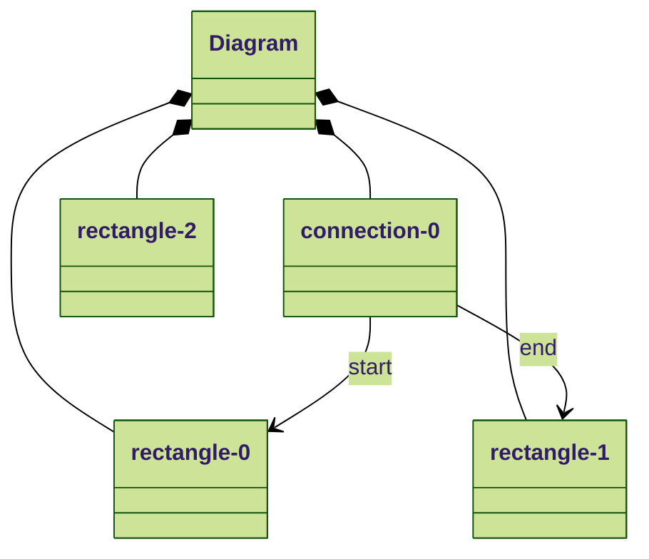

# Shapes Language

```
Diagram rectangles
    Rectangle rectangle-0
        Position: x: 10, y: 12
    Rectangle rectangle-1
        Position: x: 10, y: 12
    Connection connect-0
        start: => rectangle-1    
        end  : => rectangle-2    
```

#### AddChild rectangle-3 to Diagram rectangles

```json
{
    "messageKind": "AddChild",
    "parent": "rectangles",
    "newChild": {
        "nodes": [
            {
                "id": "rectangle-2",
                "classifier": {
                    "language": "Diagram",
                    "version": "1.0",
                    "key": "-key-Rectangle"
                },
                "properties": [],
                "containments": [],
                "references": [],
                "annotations": [],
                "parent": null
            }
        ]
    },
    "containment": {
        "language": "Diagram",
        "version": "1.0",
        "key": "-key-Diagram"
    },
    "index": 2
}
```

```
Diagram rectangles
    Rectangle rectangle-1
        Position: x: 10, y: 12
    Rectangle rectangle-2
        Position: x: 10, y: 12
    Rectangle rectangle-3
        Position: x: 10, y: 12
    Connection connect-1
        start: => rectangle-1    
        end  : => rectangle-2    
```

before



After:


